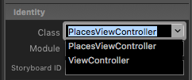

# Xamarin.iOS.GooglePlacesAutocomplete

A simple Google Places API autocompleting search view controller for native Xamarin iOS apps. Inspired by the [brilliant Swift example](https://github.com/watsonbox/ios_google_places_autocomplete) created by [Howard Wilson](http://watsonbox.github.com/).

 <center></center>


### Contributing
Solution is currently incomplete. If you wish to contribute, you're very welcome to submit pull requests or get in touch.


### Obtaining API key
Use the [Google Developers Console](https://console.developers.google.com/) to enable the 'Google Places API Web Service' and create a 'Server' API key credential. In both cases do not use the iOS options.


## How to implement PlacesViewController

> Ensure that you install **Newtonsoft.Json** in your iOS project. 

### Using the PlacesViewController programmatically

If you are creating your iOS app without using storyboards, or wish to launch the view programmatically:

```csharp
// 1. Instantiate the PlacesViewController
placesViewController = new PlacesViewController();
placesViewController.apiKey = "<Your API key here>";
// TODO - set PlaceType

// 2. Subscribe to PlaceSelected delegate to get place details
placesViewController.PlaceSelected += HandlePlaceSelection;

// 3. Instantiate the UINavigationController to contain the PlacesViewController
placesViewContainer = new UINavigationController(placesViewController);

// 4. Present the view
PresentViewController(placesViewContainer, true, null);
```
Your HandlePlaceSelection delegate method:

```csharp
void HandlePlaceSelection(object sender, JObject placeData)
{ 
    // 5. Handle the place details however you wish
    Console.WriteLine($"{placeData}");
}
```


### Using the PlacesViewController with Storyboards (iOS Designer)

To implement using the iOS designer for Xamarin or XCode Storyboard Editor:

1. Drag a new UINavigationController into the storyboard (ensuring it also places a child view controller)

2. Select the new child view controller and in Identity>Class dropdown, select PlacesViewController:


3. 
